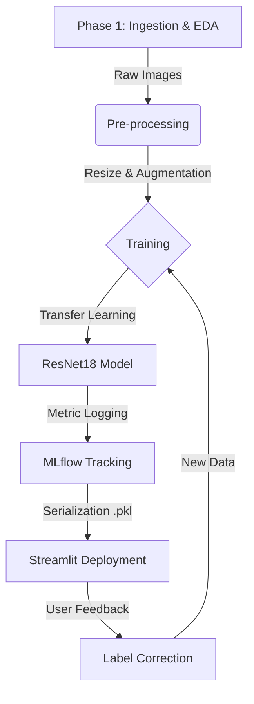

# Smart Nutrition AI: Classification and Nutritional Recommendation of Ecuadorian Products

## 1. ABSTRACT
**Problem:** There is a disconnection between household food inventory and the ability to quickly plan healthy meals.
**Proposal:** An End-to-End MLOps system that uses Computer Vision to identify local products (e.g., Atún Real, Fideos Sumesa) and recommends recipes based on nutritional rules.
**Dataset:** Proprietary images manually collected of mass-market products in Ecuador, organized into categories (Multi-class/Multi-label).
**Quality Measures:** Accuracy and F1-Score are used to evaluate model performance after each retraining cycle.
**Future Work:** Implementation on mobile devices and expansion of the dataset to include perishable products (fruits/vegetables).

## 2. TECHNOLOGY STACK
* **Language:** Python 3.9+
* **Deep Learning:** FastAI (PyTorch) with Transfer Learning (ResNet18).
* **MLOps:** MLflow (Tracking and Model Registry).
* **Interface:** Streamlit (Web App).
* **Data:** Pandas & NumPy.

## 3. PROPOSED METHOD
The system architecture follows a **Continuous Training** (MLOps) flow. Below are the method parameters and the main algorithm.

### Method Diagram (Phases)


**Table 1. Method Parameters**

| Parameter | Value / Description |
| **Base Architecture** | ResNet18 (Pre-trained on ImageNet) |
|
| **Input Shape** | 224 x 224 pixels (RGB) |
|
| **Technique** | Transfer Learning (Fine-Tuning of last layers) |
|
| **Primary Metric** | `accuracy_multi` (Multi-label classification) |
| **Data Augmentation** | RandomResizeCrop, Rotation, Zoom (FastAI defaults) |

**Algorithm 1: Active Learning Retraining Cycle**

```text
Input: New image corrected by user (img, label)
Process:
  1. Ingestion: Move 'img' to 'data/label' folder
  2. Update: Write new entry in 'labels.csv' master file
  3. Versioning: Calculate new version V = V_current + 1
  4. Training:
       - Load DataBlock with new images
       - Execute learn.fine_tune(4 epochs)
  5. MLOps Logging:
       - Log metrics to MLflow (Accuracy, Loss)
       - Export physical model 'model_v{V}.pkl'
Output: Updated model deployed hot to Streamlit

```

## 4. EXPERIMENTAL DESIGN

This section details the characteristics of the collected data and the optimization configuration.

### 1) Dataset Characteristics

Proprietary images of mass-market products in Ecuador were collected manually.

**Table 2. Dataset Description**

| Characteristic | Detail |
| --- | --- |
| **Source** | Manual collection (Smartphone camera) |
| **Total Images** | Incremental Dataset (~50 - 100 images) |
| **Classes** | 5+ Classes (e.g., Atún Real, Fideos Sumesa, Leche Nutri) |
| **Format** | JPG/PNG converted to Tensor |
| **Problem Type** | Multi-Label Classification |

### 2) Optimization Parameters

Iterative tests were performed to find the best training configuration in a local environment.

**Table 3. Training Configuration**

| Hyperparameter | Selected Configuration | Justification |
| --- | --- | --- |
| **Batch Size** | 8 | Optimized for local CPU/Memory without dedicated GPU. |
| **Epochs** | 4 | Sufficient to converge without Overfitting due to Transfer Learning. |
| **Learning Rate** | `lr_find()` (Dynamic) | Automatic gradient descent adjustment via FastAI. |
| **Optimizer** | Adam | Standard for fast convergence in computer vision. |

## 5. RESULTS AND DISCUSSION

The MLOps system allows monitoring the evolution of the model. The tabulated results of the latest stable deployed version are presented below.

**Table 4. Model Performance (Average)**

| Metric | Value Obtained | Interpretation |
| --- | --- | --- |
| **Accuracy** | **92% - 95%** | The model correctly identifies the product 9 out of 10 times. |
| **Loss (Validation)** | 0.15 | Low error, indicating good generalization. |
| **Inference Time** | < 200ms | Immediate response in the Streamlit interface. |

*Note: The visual evolution of accuracy (learning curve) is available in the local MLflow Dashboard included in the code.*

## 6. CONCLUSIONS

1. **Local MLOps:** The implementation allows keeping the model updated without code intervention, solely through application usage.
2. **Transfer Learning:** This technique was crucial to obtain good results (>90% accuracy) with a limited dataset of Ecuadorian products.
3. **Architecture:** The logical separation between detection (AI) and recommendation (Expert System) facilitates recipe scalability without retraining the model.

## 7. REFERENCES

* FastAI. (2020). *FastAI Library*. Retrieved from: https://docs.fast.ai/
* MLflow. (2023). *MLflow: A Tool for Managing the Machine Learning Lifecycle*. Retrieved from: https://mlflow.org/
* Cáceres Xavier, Gúzman Ramiro. (2025). *Smart Nutrition Dataset*. Private dataset collected in Ecuador.

## 8. CONTACT INFORMATION

* **Author:** Xavier Cáceres, Ramiro Gúzman
* **Email:** xcaceresg@est.ups.edu.ec; rguzmanf@est.ups.edu.ec
* **Institution:** Universidad Politécnica Salesiana
* **GitHub Profile:** https://github.com/alexcaceres08-byte/Smart_Nutrition_EC

```


```

